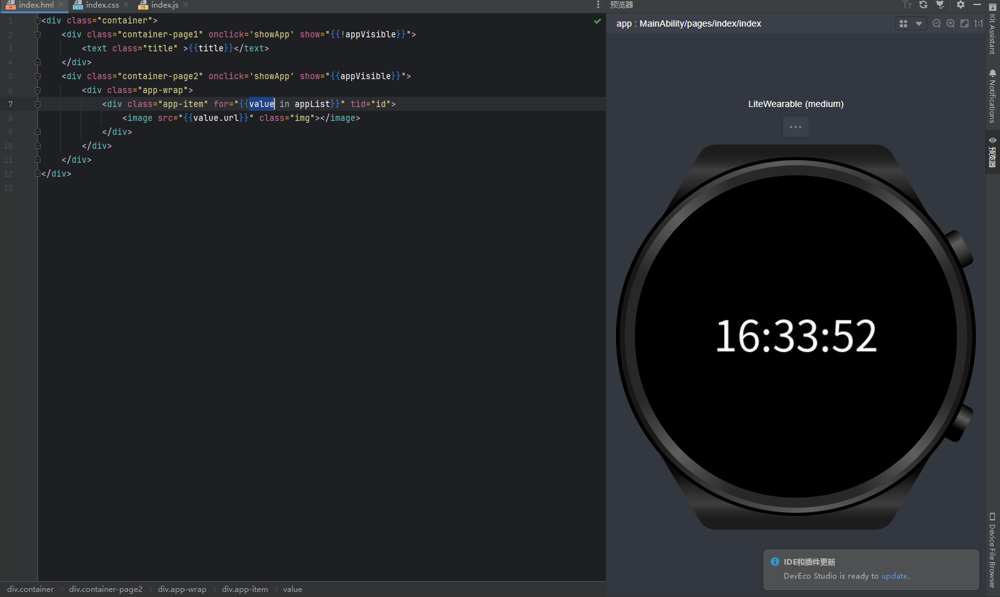

::: tip 介绍
鸿蒙基础入门<br>
:::

 *以下为自写demo，能存在错误*！ 

##  本教程将模拟一个穿戴设备的交互开发，成品效果如下
<br>
<br>
<br>



## 以下为学习必要环节及相关软件

`HarmonyOS SDK` 是一个开放能力合集，提供应用框架、应用服务、系统、媒体、AI、图形在内的六大领域丰富完备的能力。

`元服务` 元服务是一种轻量程序形态，具备免安装的优点，可独立分发、运行。简单来讲，可以理解为它就是类似微信小程序、支付宝小程序的轻应用。

`鸿蒙原生应用` 鸿蒙的原生应用包含手机、Pad、TV、车载智慧屏和穿戴设备。

`DevEco Studio`就是长的像IDEA的代码编译器。

`ArkTs`ArkTS是鸿蒙生态的应用开发语言，它在保持TypeScript基本语法风格的基础上，进一步通过规范强化静态检查和分析

`ArkUI`ArkUI是一套构建分布式应用界面的声明式UI开发框架。简单来说，ArkUI是基于ArkTS的声明式的UI开发范式 ，是ArkTS语言的一个具体应用或扩展，用于构建用户界面。ArkTs和ArkUI前端同学可以简单理解为js和element UI的关系。


## 开发准备

`UI框架（ArkUI）` 声明式开发范式，兼容JS的类Web开发范式

通常在使用 git fetch 获取了最新的远程更改后，使用 git merge 将这些更改合并到当前分支。

```sql
web写法
// index.thml
<div class="container">
    <text class="title">
        你好 {{ title }}
    </text>
</div>
// index.js
export default {
    data: {
        title: ''
    },
    onInit() {
        this.title = "石小石";
    }
}
// index.css
.container {
  width: 100%;
  height: 100%;
  justify-content: center;
  align-items: center;
}


//声明式写法
@Entry
@Component
struct Index {
  @State message: string = '你好,石小石';

  build() {
    RelativeContainer() {
      Text(this.message)
        .id('HelloWorld')
        .fontSize(50)
        .fontWeight(FontWeight.Bold)
        .alignRules({
          center: { anchor: '__container__', align: VerticalAlign.Center },
          middle: { anchor: '__container__', align: HorizontalAlign.Center }
        })
    }
    .height('100%')
    .width('100%')
  }
}
```
## 构建应用

工程创建

1.点击Create Project创建工程


2.选择Application应用（tomic Service为元服务开发)

3.选择模板（接触过uni的很熟悉这种风格）

4.选择[Lite]Empty Ability模板（穿戴应用）


```JS
// 目录结构
app.js                              用于全局JavaScript逻辑和应用生命周期管理
├── pages                           pages目录用于存放所有组件页面
│   ├── index
│   │   ├── index.hml               描述当前页面的文件布局结构
│   │   ├── index.css               描述页面样式
│   │   └── index.js                处理页面间的交互
│   ├── detail (可选)
│   │   ├── detail.hml              描述当前页面的文件布局结构
│   │   ├── detail.css              描述页面样式
│   │   └── detail.js               处理页面间的交互
├── common (可选)                    common目录用于存放公共资源文件，比如：媒体资源，自定义组件和JS文件。
│   ├── xxx.png
│   ├── utils.js
│   ├── style.css
│   └── component
│       ├── componentA.hml
│       ├── componentA.css
│       └── componentA.js
├── resources (可选)                resources目录用于存放资源配置文件，比如：多分辨率加载等配置文件
│   ├── styles
│   │   └── default.json
│   ├── res-ldpi.json
│   ├── res-xxhdpi.json
│   └── res-defaults.json
└── i18n (可选)
    ├── zh-CN.json
    └── en-US.json

// ...

config.json                         项目配置、项目名称、版本；页面的路由配置等        
```

5.生命周期
```js
export default {
    onCreate() {
        console.info('页面创建');
    },
    onDestroy() {
        console.info('页面销毁');
    }
};

```

6.配置文件(config.json)

```JS
{
  "app": {
    "bundleName": "com.example.player",
    "version": {
        "code": 1,
        "name": "1.0"
    },
    "vendor": "example"
  }
  "module": {
    ...
    "js": [
      { 
        "name": "default",
         // 路由信息
        "pages": [
          "pages/index/index",
        ]
      }
    ],
    "abilities": [
      {
        ...
      }
    ]
  }
}

```

7.构建应用


```JS
// hml
<div class="container">
    <div class="container-page1" onclick='showApp' show="{{!appVisible}}">
        <text class="title" >{{title}}</text>
    </div>
    <div class="container-page2" onclick='showApp' show="{{appVisible}}">
        <div class="app-wrap">
            <div class="app-item" for="{{value in appList}}" tid="id">
                <image src="{{value.url}}" class="img"></image>
            </div>
        </div>
    </div>
</div>
```

```JS
import {getTime} from "../../common/utils"
export default {
    data: {
        title: '',
        appVisible:false,
        appList:[
            {name:"抖音",url:"common/img/dy.png",id:1},
            {name:"京东",url:"common/img/jd.png",id:2},
            {name:"健康",url:"common/img/jk.png",id:3},
            {name:"拼多多",url:"common/img/pdd.png",id:4},
            {name:"皮皮虾",url:"common/img/ppx.png",id:5},
            {name:"天气",url:"common/img/tq.png",id:6},
            {name:"微信",url:"common/img/wx.png",id:7},
            {name:"网易云",url:"common/img/wy.png",id:8},
            {name:"支付宝",url:"common/img/zfb.png",id:9},
        ]
    },
    showApp(){
        this.appVisible = !this.appVisible
    },
    onInit() {
        this.title = 'Hello ！';
        setInterval(()=>{
            this.title = getTime();
        },1000)
    }
}
```

后续代码根据业务进行实现


