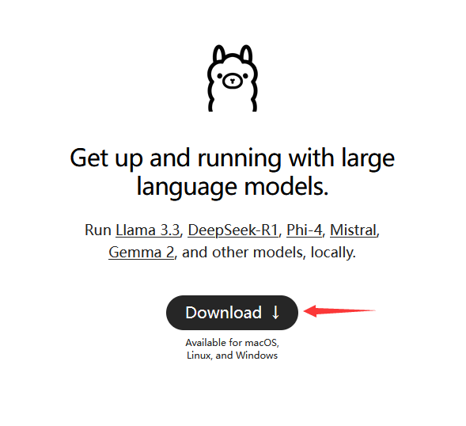
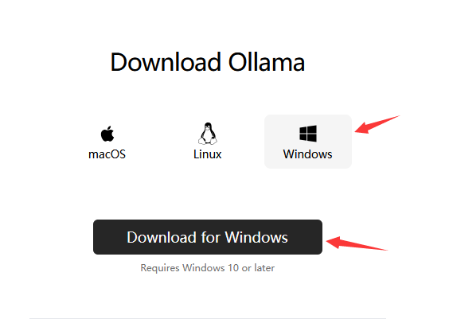
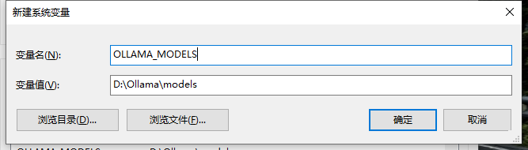
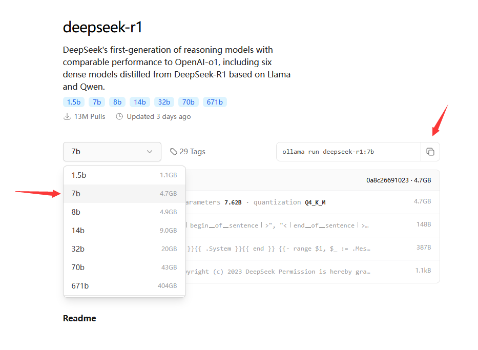
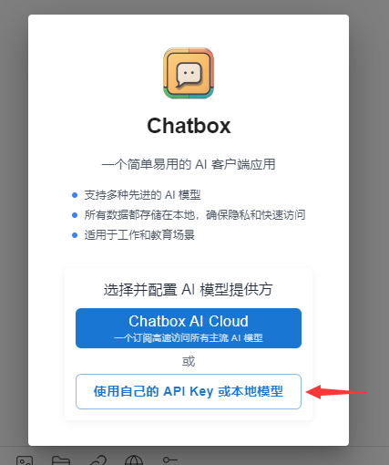
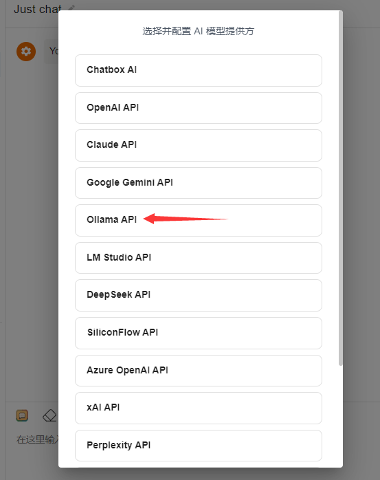
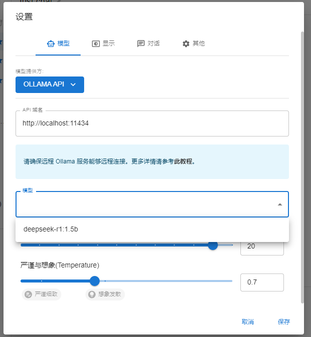

::: tip 介绍
Windows 环境下安装 ollama，下载 deepseek-r1 模型，并对接 chatbox UI 部署本地AI服务。<br>
:::

 

安装 ollama
1，访问 ollama 官网： https://ollama.com/

2，点击 Download 下载安装包



3，选择 Window 版本下载



4，双击安装 OllamaSetup.exe，默认 ollama 会自动安装到C盘，如果需要自定义安装目录，请使用CMD运行如下命令：

 ```
 OllamaSetup.exe /DIR=D:\Ollama
 ```

5，安装完成以后，默认的模型下载位置在 C:\Users\Administrator\.ollama\models，如果需要切换到其他位置，请添加如下环境变量：

```
变量名：    OLLAMA_MODELS
变量值：    D:\Ollama\models
```


6，打开模型下载页面，选择对应的版本：https://ollama.com/library/deepseek-r1



注：如果不知道选择哪个版本合适，可以参考 模型版本说明

7，命令行运行AI，如果是第一次运行，则会自动下载模型：

 复制代码
ollama run deepseek-r1:7b
注：如果模型下载速度过慢，也可以从其他渠道下载完模型以后，复制到 ollama 的 models 目录下，默认的 models目录为 ：C:\Users\Administrator\.ollama\models

8，模型下载成功以后，会自动进入对话页面，输入内容测试一下AI后，按下 Ctrl + D 退出即可


安装 chatbox
1，打开 chatbox 官网： https://chatboxai.app/zh

2，下载安装包完成安装

3，打开 chatbox ，会提示你选择AI模型提供方，选择本地模型



4，选择 Ollama API



5，选择出对应的模型



6，配置完成，输入问题测试AI即可


模型版本说明


适用场景
轻量级应用，需要快速响应需求可以选择1.5B、7B 这样的小模型可以快速加载和运行，能够在较短时间内给出结果，满足用户的即时需求，小模型适合一些对响应速度要求高、硬件资源有限的场景，如手机端的智能助手、简单的文本生成工具等；在科研、学术研究、专业内容创作等对准确性和深度要求较高的领域，选择70B、32B等大模型更适合。

671B：适用于对准确性和性能要求极高、对成本不敏感的场景，如大型科研机构进行前沿科学研究、大型企业进行复杂的商业决策分析等。


1.5B-7B：适合对响应速度要求高、硬件资源有限的场景，如移动端的简单智能助手、轻量级的文本生成工具等，可快速加载和运行。


8B-14B：可用于一些对模型性能有一定要求，但又没有超高性能硬件支持的场景，如小型企业的日常文本处理、普通的智能客服等。


32B-70B：能满足一些对准确性有较高要求，同时硬件条件相对较好的场景，如专业领域的知识问答系统、中等规模的内容创作平台等。